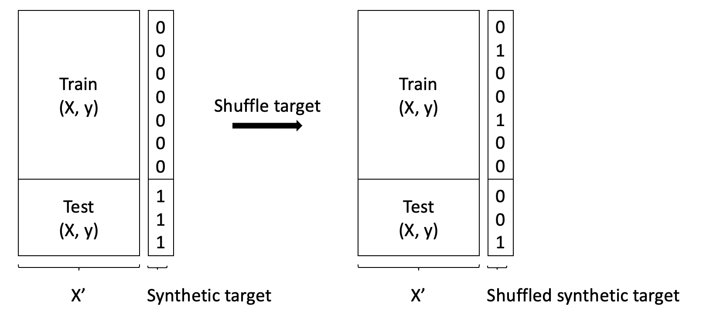

# Are train and test sets are drawn from the same distribution?
*Implementation of the awesome trick I learned from [MSDS 621](https://github.com/parrt/msds621)* 

Bofore any modelling work, we always want to determine if we have a valid test set, namely train and test sets are drawn from the same distribution. 

To do that, we can make up a target column in which the value will be 0 for train set and 1 for test set. If tran and test sets are from the same distribution, a classifier should give us a bad metric on this synthetic dataset as there is no way to distinguish between train and test. This is the main idea of this trick. But the classifier model can be so strong that it could "memorize" the synthetic dataset and still output a good metric value. To mitigate the influence of the model, we can shuffle the maked up target column and compare the metrics before and after the shuffle. If the metric before shuffle is better than after shuffle, it indicates that the train and test set are different.

